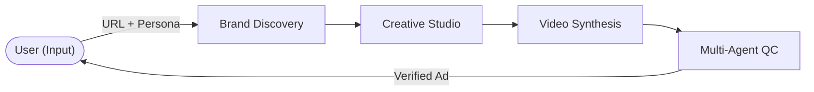
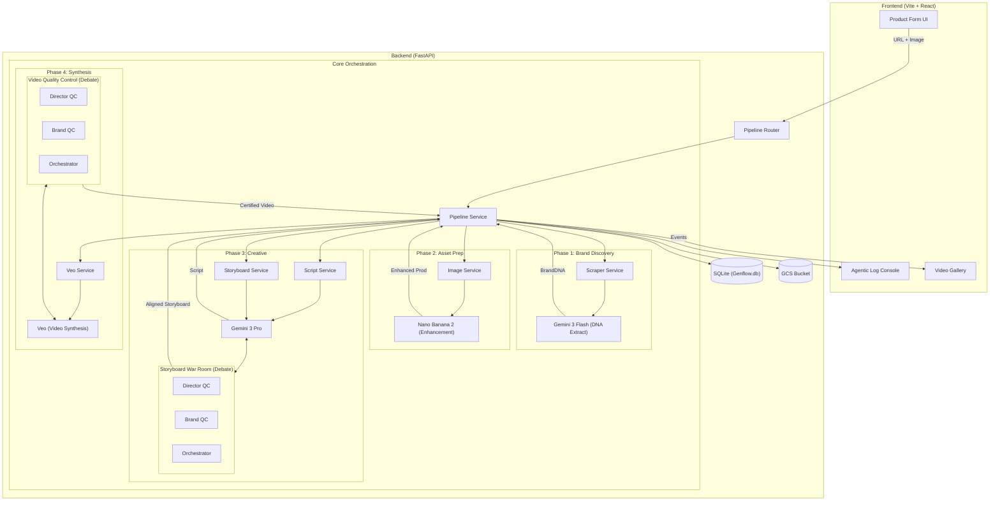

# Genflow Ad Studio Architecture

## High-Level Workflow (Conceptual)

This diagram shows the simplified user journey and the primary orchestration blocks.

---

## Detailed Systems Architecture

This diagram illustrates the end-to-end technical workflow, highlighting the "Pomelli-lite" brand integration and the Agentic Debate systems.

## Component Breakdown

1.  **Brand Discovery**: Extracts `tone_of_voice` and `target_demographic` from a provided URL to steer the entire creative process.
2.  **Asset Prep**: Uses **Nano Banana 2** (Gemini 3 Flash Image) to upscale and enhance raw product photos into studio-quality background plates.
3.  **Storyboard War Room**: A multi-agent debate loop where separate "Director" and "Brand" agents critique storyboard frames for brand alignment before finalization.
4.  **Video Quality Control**: A final agentic feedback loop overseeing Veo video synthesis, ensuring zero hallucinations and strict adherence to the brand's DNA.
